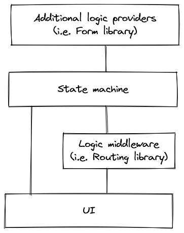

# XState Navigation

Xstate navigation is a personal sandbox for experiments with adopting Xstate library and State Machines in architecture of frontend applications. It's purpose was for playing around with library's api, different approaches as well as searching for patterns to use in normal applications. It's shape is rather an effect of experiments than conscious learning as I haven't check any publications of using State Machines / XState on frontend applications before.

It contains frontend application in form of a 4 steps User journey. In order to get to another step, user has to fulfill previous ones. It is possible to return to previous steps and change previous decisions.

Application is written using Type Script. It's based on Vite, XState, React Router, React Final Forms with YUP for validation, React Context with Immer for immutability as well as Material-UI with Emotion library for better styling.

## Architectural approach

During experiments it's turned out that State Machines may create separate layer of logic. The state of machine may describe how application should look like and what changes are available at given moment.

Given state might be translated to information whether some component is visible or not. You may take an error message informing that api call has been rejected as an example. This component should be visible only when machine is on `confirm-choices-page.rejected` state.

State machine is exposing possible changes of a state. For example, once machine is on `confirm-choices-page.pending` state (it means POST api call is on a pending state), it is possible to change it to other states:

- `confirm-choices-page.rejected` - by sending `reject` signal
- `confirm-choices-page.resolved` - by sending `resolve` signal

In both cases, signals should be triggered by fetch library, during handling an api call. Changing states should resolve with visual changes on the page:

- `confirm-choices-page.rejected` - spinner should disappear, `NEXT` and `PREV` buttons should become enabled, error message should display
- `confirm-choices-page.resolved` - applications should redirect into `/thank-you` page displaying final content.

## Available scripts

### `npm install`

Installs all dependencies.

### `npm run dev`

Starts server in development mode. The application is available on http://localhost:3000/

## Learn More

Below is the list of most important technologies used to form this component:

- [XState](https://xstate.js.org/)
- [Stately](https://stately.ai/)
- [Vite](https://vitejs.dev/)
- [React Final Form](https://final-form.org/react)
- [React Router](https://reactrouter.com/en/main)